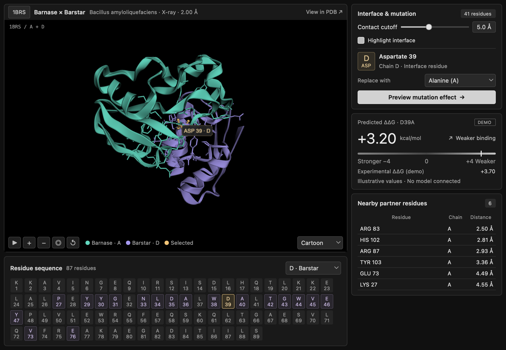

# ProteinBinding

An early desktop GUI for our protein-binding project, built with PySide6, Qt Widgets, and 3Dmol.js. It currently runs with a small demo adapter so we can develop the GUI before the scientific backend is ready.

The layout puts the 3D structure and residue sequence on the left, and interface settings, mutation selection, demo predictions, and nearby residues on the right.



## Set up the environment

Install [micromamba](https://mamba.readthedocs.io/en/latest/installation/micromamba-installation.html) first. Run the following commands from the project root, where this README is located.

Use `environment.yml` as the shared environment definition. It includes Python 3.12 and the project's Python dependencies.

Create the environment once:

```bash
micromamba create -n ProteinBinding -f environment.yml -y
```

Activate it before running the project:

```bash
micromamba activate ProteinBinding
```

When adding a package, add it to `environment.yml` and commit that change. Teammates can then update their existing environment with:

```bash
micromamba env update -n ProteinBinding -f environment.yml
```

## Download the local resources

The `resources/` directories are excluded from Git. Run both commands after cloning; they create the target directories automatically.

Download the pinned 3Dmol.js library:

```bash
curl --fail --location --create-dirs \
  'https://cdn.jsdelivr.net/npm/3dmol@2.5.3/build/3Dmol-min.js' \
  --output src/resources/vendor/3Dmol.min.js
```

Download the demo structure, [RCSB 1BRS](https://www.rcsb.org/structure/1BRS):

```bash
curl --fail --location --create-dirs \
  'https://files.rcsb.org/download/1BRS.pdb' \
  --output src/resources/demo/1brs.pdb
```

These files are required to launch the GUI. Once downloaded, the viewer runs locally without a server or an internet connection. 

## Run

With the `ProteinBinding` environment active, run:

```bash
python src/__main__.py
```

## Project structure

The main files and their responsibilities:

```text
.
├── environment.yml             # Primary environment and dependency definition
├── pyproject.toml              # Ruff configuration
├── README.md
├── reference/
│   └── hras_project/           # Alan's existing example code and structure data
│       ├── 4EFL.cif
│       └── pdb_parser.py
├── src/
│   ├── __main__.py             # Entry point and wiring of concrete implementations
│   ├── contracts.py            # GUI-facing data types and interfaces
│   ├── presenter.py            # User actions, application state, and workflow
│   ├── view.py                 # Qt window and standard widgets
│   ├── viewer.py               # Molecular viewer and Python–JavaScript bridge
│   ├── tasks.py                # Background task execution
│   ├── style.qss               # Qt colors, typography, and widget styles
│   ├── icons/                  # Small, tracked GUI assets
│   ├── viewer_web/
│   │   ├── index.html          # Local page inside QWebEngineView
│   │   └── viewer.js           # 3Dmol rendering and selection events
│   ├── adapters/
│   │   ├── __init__.py
│   │   ├── demo.py             # Temporary backend with fixed prediction fixtures
│   │   └── demo_residues.json  # Precomputed geometry for the single demo structure
│   ├── backend/               # Backend implementation goes here
│   └── resources/
│       ├── demo/
│       │   └── 1brs.pdb        # Downloaded locally; excluded from Git
│       └── vendor/
│           └── 3Dmol.min.js    # Downloaded locally; excluded from Git
└── tests/
    ├── functional/            # unittest: real Qt/WebEngine and worker integration
    └── unit/                  # unittest: presenter behavior without Qt
```

## Tests and code checks

Tests use Python's standard-library **`unittest`**. The tests cover presenter behavior, GUI signal wiring, layout stability, and worker callbacks. Run commands from the project root with the environment active.

Fast presenter tests, without starting Qt or downloading the viewer resources:

```bash
PYTHONPATH=src python -m unittest discover -s tests/unit -v
```

## Team to-do list

- [ ] Natalie: Data extraction
- [ ] Julian: GUI
- [ ] Alan: Further data manipulation

## Message board

**Julian**: This is the initial structure I've put together to get us started. **I am open to any change**, so please feel free to suggest a different layout or approach if it works better for the team. Please put your backend code in **`src/backend/`** and design the functions however makes sense for your work. Once your code is ready, I'll read through it and write the adapters to connect it to the GUI. A short usage example showing the inputs and outputs would be really helpful when we get to that point. Thanks! 
